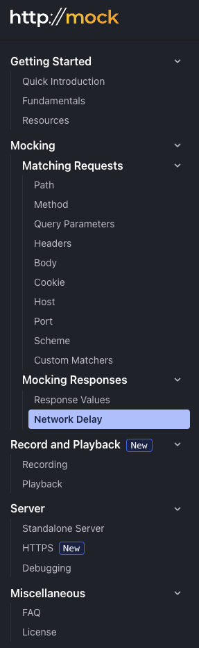

{/* import */}

import { Icon } from 'astro-icon/components'
import { Notification } from 'accessible-astro-components'

{/* content */}

# httpmock を調べる

crateを触ってみる第二弾。

- [httpmock - crates.io: Rust Package Registry](https://crates.io/crates/httpmock)
- [Quick Introduction \| httpmock Tutorial](https://httpmock.rs/getting_started/quick_introduction/)

Tutorialを触ることにする。

`tests/example-1.rs` を作成。

```rust
use httpmock::prelude::*;
use regex::Regex;
use reqwest::blocking::Client;

#[test]
fn body_test() {
    // Arrange
    let server = MockServer::start();

    let m = server.mock(|when, then| {
        when.method(POST)
            .path("/books")
            .body("The Fellowship of the Ring")
            .body_includes("Ring")
            .body_matches(Regex::new("Fellowship").unwrap());
        then.status(201).body("The Lord of the Rings");
    });

    // Act: Send the request
    let client = Client::new();
    let response = client
        .post(&format!("http://{}/books", server.address()))
        .body("The Fellowship of the Ring")
        .send()
        .unwrap();

    // Assert
    m.assert();
    assert_eq!(response.status(), 201);
}
```

依存関係は、Cargo.tomlに以下を追加

```toml
[dev-dependencies]
httpmock = "0.8.0-alpha.1"
```

さらに以下のコマンドを打つ

```sh
cargo add regex
cargo add reqwest -F blocking
```

feature付きのやつを使う時は `cargo add <crate_name> -F <feature_name>` で追加する。

テストを実行

```
$ cargo test
...
    Finished `test` profile [unoptimized + debuginfo] target(s) in 10.20s
     Running unittests src/main.rs (target/debug/deps/httpmock_playground-6d3d5a82fd467a4e)

running 0 tests

test result: ok. 0 passed; 0 failed; 0 ignored; 0 measured; 0 filtered out; finished in 0.00s

     Running tests/example-1.rs (target/debug/deps/example_1-a214e7683e0a14f6)

running 1 test
test body_test ... ok

test result: ok. 1 passed; 0 failed; 0 ignored; 0 measured; 0 filtered out; finished in 0.05s
```

通った。

コードの中身を読んでいく。

Arrange, Act, Assertってなんだっけ。
単体テストを書くときのパターンで、Arrangeが準備、Actが実行、Assertが検証のこと。

単体テストの考え方/使い方を読んだ。
3.1 単体テストの構造に書かれているAAAパターンがそれに該当する。Given, When, Thenパターンという似たものもある。

今回は

- Arrange: mock serverを立てて、その振る舞いを決める。`body`, `body_includes`, `body_matches` は ~~ORの関係になっているのかな？~~ (訂正: ANDの関係になっている) どれかを満たせば `&str` 型で返答を返す。
- Act: clientを作り、mockサーバに対してリクエストを投げる。
- Assert: `m.assert()` は何をしているんだろう？あとはステータスコードを `assert_eq!` で検証。

assertについて調べる。 [Mock in httpmock - Rust](https://docs.rs/httpmock/0.7.0/httpmock/struct.Mock.html#method.assert)

> This method asserts that the mock server received exactly one HTTP request that matched all the request requirements of this mock.
> 
> Attention: If you want to assert more than one request, consider using either Mock::assert_hits or Mock::hits.

- mockが1度だけリクエストを受け取ること
- mockが定めたリクエストに対する要求を全て満たしていること

を保証するのが `m.assert()` になる。

このmockが定めたリクエストに対する要求がよく分からないのでちょっとテストを変えてみる。

```rust
    let response = client
        .post(&format!("http://{}/books", server.address()))
        .body("The Fellowship of the ing") // Ring を ing に変更してみる
        .send()
        .unwrap();
```

するとテストが落ちる。ORじゃなかったんだ。

```sh
running 1 test
test body_test ... FAILED

failures:

---- body_test stdout ----
thread 'body_test' panicked at /home/uta8a/.cargo/registry/src/index.crates.io-6f17d22bba15001f/httpmock-0.8.0-alpha.1/src/api/output.rs:48:17:
assertion `left == right` failed: 0 of 1 expected requests matched the mock specification.
Here is a comparison with the most similar unmatched request (request number 1): 

------------------------------------------------------------
1 : Body Mismatch 
------------------------------------------------------------
Expected body equals:
The Fellowship of the Ring

Received:
The Fellowship of the ing

Diff:
---| The Fellowship of the Ring
+++| The Fellowship of the ing

Matcher:  body
Docs:     https://docs.rs/httpmock/0.8.0-alpha.1/httpmock/struct.When.html#method.body
 
------------------------------------------------------------
2 : Body Mismatch 
------------------------------------------------------------
Expected body includes:
Ring

Received:
The Fellowship of the ing

Diff:
---| Ring
+++| The Fellowship of the ing

Matcher:  body_includes
Docs:     https://docs.rs/httpmock/0.8.0-alpha.1/httpmock/struct.When.html#method.body_includes
 

  left: "The Fellowship of the Ring"
 right: "The Fellowship of the ing"
note: run with `RUST_BACKTRACE=1` environment variable to display a backtrace


failures:
    body_test

test result: FAILED. 0 passed; 1 failed; 0 ignored; 0 measured; 0 filtered out; finished in 0.05s

error: test failed, to rerun pass `--test example-1`
```

`body`, `body_includes` が落ちている。 `Fellowship` は存在するので落ちてない。

```sh
Expected body equals:
The Fellowship of the Ring

Received:
The Fellowship of the ing

Diff:
---| The Fellowship of the Ring
+++| The Fellowship of the ing

Matcher:  body
```

このMatcherも出しているのは偉いな。MatcherとExpectedでテストのどこで落ちたか一意に特定できる。

<Notification type="info">
`httpmock` はclientからのリクエストが満たすべき条件をサーバ側で検証できるmock serverを立てることができるcrate
</Notification>

思ったけどwhen, thenとかを見ると httpmock は given, when, then パターンに近い感じがする。

ここで実装がどうなっているのかみてみたい。 `MockServer::start()` で `std::net` を使っているか調べる。

[`MockServer::start()` の実装](https://github.com/alexliesenfeld/httpmock/blob/1cb975125d0cba90fe64a221391537ebf8cd93d1/src/api/server.rs#L200-L216C6) のコメントを読むと、`start` 時はサーバのプールをバックグラウンドで管理するものが立ち上がる。新しくモックサーバが毎回作られるわけではなさそう。

- MockServerが必要になる
  - 上限に達している→空きのMockServerが出てくるまでblockされる
  - まだ空きがある→新しいMockServerを作成する

という動きになっている。

それは実装としては [ここ](https://github.com/alexliesenfeld/httpmock/blob/1cb975125d0cba90fe64a221391537ebf8cd93d1/src/api/server.rs#L1367-L1376C2) で、25台がデフォルト上限。 `HTTPMOCK_MAX_SERVERS` という環境変数で変えられる。

ドキュメント的には [Fundamentals](https://httpmock.rs/getting_started/fundamentals/) に書いてありそう。

- なぜMockするのか
  - external dependenciesを避けるため
- モックの基礎
  - `mock()` はHTTPリクエストが満たすべき条件を記述する。
  - `when` はbuilderで、モックサーバがどういう条件でレスポンスを返すかを定義する
  - `then` は `when` で定めた条件に合致するときどういうレスポンスを返すかを定義する
  - `when` を満たさない場合は毎回404を返す
- Test Execution and Pooling にさっきコメント見て理解したプールの話が書いてある。

<Notification type="info">
`httpmock` の `MockServer.start()` はプールを初期化するものであって、毎回作っているわけではない。
</Notification>

[どうやら `tokio` のTcpListenerを使ってそう。](https://github.com/alexliesenfeld/httpmock/blob/1cb975125d0cba90fe64a221391537ebf8cd93d1/src/server/server.rs#L19)

あとは機能をざっくり見ていこう。



機能としては基本的なパスやヘッダーなどを取り扱うMocking Matching Requestsと、Mocking Responsesがある。Network delayとかもできる。

それに加えて、Record and Playbackという機能がある。ちょっと気になるのでみる。

```sh
     Running tests/recording-example.rs (target/debug/deps/recording_example-3896b3efd312e5ba)

running 0 tests

test result: ok. 0 passed; 0 failed; 0 ignored; 0 measured; 0 filtered out; finished in 0.00s
```

examplesを実行したいが、Recordingされない。

`code is inactive due to #[cfg] directives: feature = "proxy" and feature = "record" are disabled` と書いてある。featureを有効にする。

```txt
error[E0433]: failed to resolve: could not find `ring` in `crypto`
  --> /home/uta8a/.cargo/registry/src/index.crates.io-6f17d22bba15001f/httpmock-0.8.0-alpha.1/src/common/http.rs:45:29
   |
45 |             rustls::crypto::ring::default_provider()
   |                             ^^^^ could not find `ring` in `crypto`
```

rustlsで落ちる。よく分からない。

以下で再挑戦。

```toml
[package]
name = "httpmock-playground"
version = "0.1.0"
edition = "2021"

[dependencies]
regex = "1.11.1"
reqwest = { version = "0.12.12", features = ["blocking"] }

[dev-dependencies]
httpmock = { version = "0.8.0-alpha.1", features = ["record", "proxy"] }
```

同じエラーで落ちた。

ライブラリの中で落ちているので調査する。

rustlsのringのfeature flagを有効化してないんじゃないか？

ガチャガチャして実行できた。

- Cargo.tomlを変更

```toml
[package]
name = "httpmock-playground"
version = "0.1.0"
edition = "2021"

[dependencies]
regex = "1.11.1"
reqwest = { version = "0.12.12", features = ["blocking"] }

[dev-dependencies]
httpmock = { version = "0.8.0-alpha.1", features = ["record", "proxy"] }
rustls = { version = "0.23", features = ["ring"] }

[features]
record = []
proxy = []
```

`cargo test` を実行

```rust
test result: ok. 1 passed; 0 failed; 0 ignored; 0 measured; 0 filtered out; finished in 0.06s

     Running tests/recording-example.rs (target/debug/deps/recording_example-4ac825984362ce13)

running 1 test
test record_github_api_with_forwarding_test ... ok

test result: ok. 1 passed; 0 failed; 0 ignored; 0 measured; 0 filtered out; finished in 0.49s
```

でもシナリオファイル(YAML)は作られなかった。
元のライブラリも `cargo test` したら通るし、rustlsが原因かは不明。

よく分からないので切り上げる。

<Notification type="info">
Recording and Playbackは実行できなかった。
どうやら本物のサービスにアクセスしたときの記録をYAMLに保存して、それを元にテストできる機能のようだ。
</Notification>
